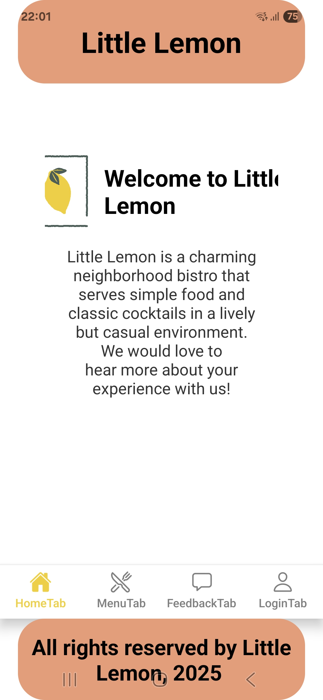
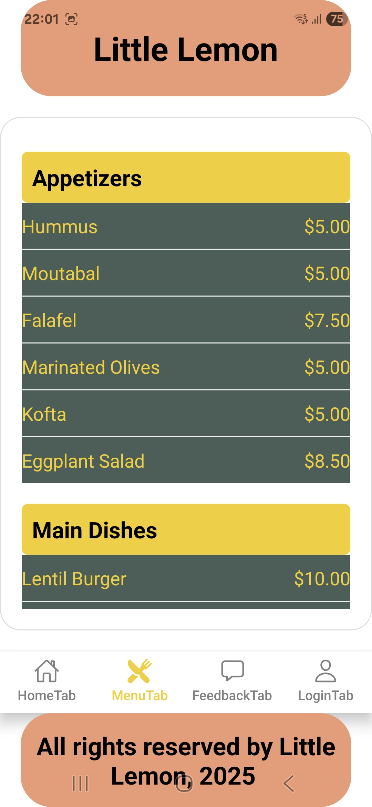
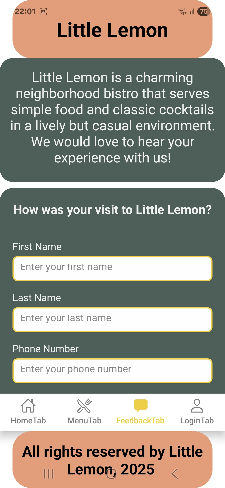
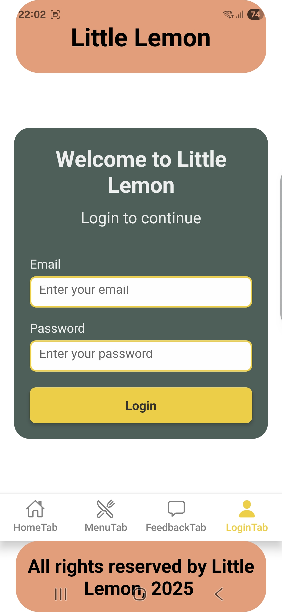

# Little Lemon Bistro

Extension project for the Meta / Coursera Professional Front-End Developer Certificate.

**Browse a Mediterranean-inspired menu, leave feedback, and explore a polished, production-grade React Native app—built with Expo, deployed with EAS, and tested on real devices.**

---

## 🚀 Demo

- [Download Latest Android APK (Expo EAS)](https://expo.dev/accounts/pokrhitman/projects/FirstProject2/builds/be02329a-c1de-4e40-aaa4-90f1b4af82c3)
- [Play Store AAB (Expo EAS)](https://expo.dev/accounts/pokrhitman/projects/FirstProject2/builds/be02329a-c1de-4e40-aaa4-90f1b4af82c3)
- [View all builds on Expo EAS Dashboard](https://expo.dev/accounts/pokrhitman/projects/FirstProject2/builds)
- *(Binaries not stored in repo due to size)*

---

## 📱 Screenshots

   

---

## Features

- 🍽️ Menu browsing with Starters, Mains, and Desserts using `SectionList`
- 📝 Feedback form with client-side validation and timed success notification
- 🎨 Centralized styles in `GlobalStyles.js` for consistent look and feel
- ⚡️ Performance optimizations (lazy-loaded screens, memoized list items)
- 🌙 Dark mode support *(coming soon)*
- 🛠️ Built and tested with Expo EAS for real production deployment

---

## Tech Stack

- React Native (Expo Managed Workflow)
- Expo EAS for builds/deployment
- React Navigation
- Centralized theming/styles
- Tested on [your device/Android version] and web

---

## 🏗️ Project Structure

little_lemon_app/
├── builds/ # (gitignored) Production .apk and .aab artifacts for local testing/distribution
├── expo/ # Expo project files and internal state
├── node_modules/ # Project dependencies (autogenerated)
├── src/
│ ├── assets/ # Images and other static assets
│ ├── components/ # Reusable UI components (buttons, cards, etc.)
│ ├── data/ # Static data files (e.g., menu items, prices)
│ ├── navigation/ # All navigation stacks, tabs, and route configs
│ ├── screens/ # Main application screens (Home, Menu, Feedback, Login, etc.)
│ ├── screenshots/ # App screenshots for README/portfolio (not shipped in production)
│ ├── styles/ # Centralized style definitions (e.g., GlobalStyles.js)
│ ├── theme/ # Theme/context files for color, dark mode, etc.
│ ├── utils/ # Utility/helper functions (validation, formatting, etc.)
│ └── web-build/ # (if using Expo web export; can be gitignored)
├── App.js # Main app entry point
├── app.json # Expo/React Native app configuration
└── package.json # Project metadata, dependencies, and scripts

---

## 💡 Lessons Learned & Highlights

- Solved production-only bug due to incorrect cross-platform imports (real mobile debugging)
- Set up Expo EAS for cloud builds, with real APK/AAB production artifacts
- Adapted navigation architecture for scalability (Tab + Stack navigators)
- Applied git/GitHub best practices (branching, .gitignore, PR workflow)
- Learned to test across multiple Android devices and emulators

---

## Getting Started

1. Clone the repository:
git clone git@github.com:<YOUR-USER>/little_lemon_app.git

2. Change into the project directory:
cd little_lemon_app

3. Install dependencies:
npm install    # or pnpm install / yarn install

4. Start the Expo development server:
npx expo start

---

## Contributing

Contributions are welcome. To get started:

1. Fork the repository
2. Create a feature branch (git checkout -b feature/YourFeature)
3. Commit your changes (git commit -m "Add feature")
4. Push to the branch (git push origin feature/YourFeature)
5. Open a pull request
6. Please ensure all new code is properly documented and tested.

---

## License

MIT License. See [LICENSE](LICENSE).

---

## Connect

- LinkedIn (https://www.linkedin.com/in/ernesto-burzi%C4%87-a19b36276/)
- GitHub (https://github.com/pokrhitman)

## Changelog

### v1.0.0 – 2024-05-22
- Refactored navigation: unique names for all screens and tabs
- Eliminated all navigation warnings
- Confirmed working build on Android device and Expo Go
- Updated README with latest screenshots and build links